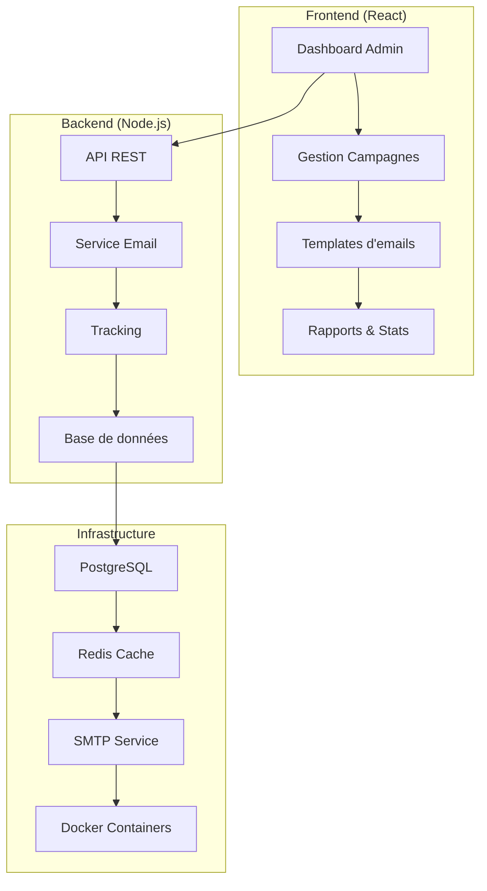

# 🎣 Système de Phishing SelfHosted

**Plateforme complète de simulation de phishing pour la formation en cybersécurité**

---

## ⚠️ AVERTISSEMENT — USAGE ÉTHIQUE UNIQUEMENT

> **🚨 IMPORTANT** : Cette application est exclusivement destinée à la **formation en cybersécurité** au sein d'entreprises. L'utilisation malveillante ou non autorisée est strictement interdite et peut être illégale.

### ✅ Usages autorisés

* Formation interne d'employés à la détection de phishing
* Sensibilisation à la cybersécurité en entreprise
* Tests de sécurité avec accord écrit de la direction
* Recherche académique en cybersécurité

### ❌ Usages interdits

* Attaques réelles de phishing
* Collecte non autorisée de données
* Usage en dehors du cadre éducatif/professionnel
* Distribution publique des templates

---

## 📋 Vue d'ensemble

Le **Simulateur de Phishing Éducatif** est une plateforme complète permettant aux équipes de sécurité de créer, lancer et analyser des campagnes de simulation de phishing à des fins de formation.

### 🎯 Objectifs

* **Sensibiliser** les employés aux techniques de phishing
* **Mesurer** le niveau de vigilance de l'organisation
* **Former** automatiquement les utilisateurs qui cliquent
* **Analyser** les résultats avec des rapports détaillés

### ✨ Fonctionnalités principales

| 🔧 **Administration**              | 📊 **Analytics**        | 🎓 **Formation**                 |
| ---------------------------------- | ----------------------- | -------------------------------- |
| Interface de création de campagnes | Dashboard temps réel    | Module de formation automatique  |
| Bibliothèque de templates          | Statistiques détaillées | Pages éducatives interactives    |
| Gestion des cibles                 | Tracking invisible      | Notifications de sensibilisation |
| Planification d'envoi              | Exports de rapports     | Ressources pédagogiques          |

### 🏗️ Architecture technique

---

## 🚀 Installation

### 📋 Prérequis

| Composant              | Version minimale | Recommandée |
| ---------------------- | ---------------- | ----------- |
| **Node.js**            | 18.0+            | 20.0+       |
| **npm**                | 8.0+             | 10.0+       |
| **PostgreSQL**         | 14.0+            | 15.0+       |
| **Git**                | 2.0+             | Dernière    |
| **Docker** (optionnel) | 20.0+            | Dernière    |

